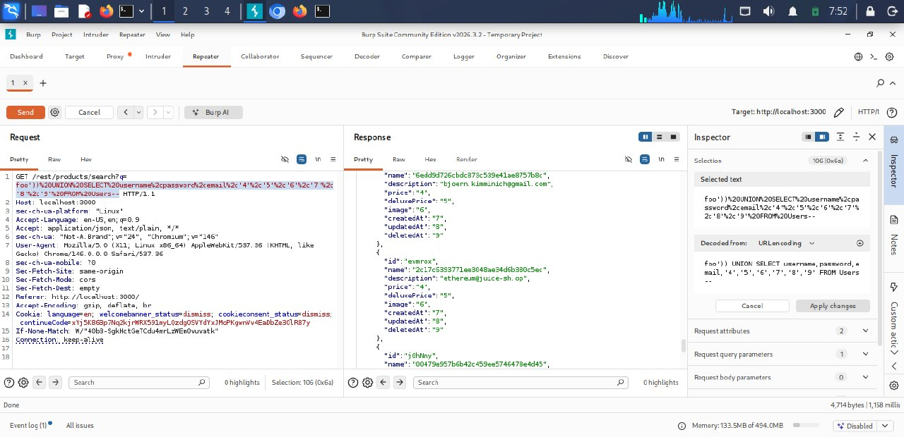
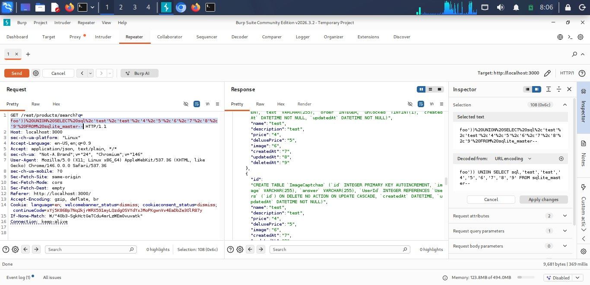

# SQL Injection — Findings

## 1. SQL Injection — Authentication Bypass

### Summary
Juice Shop's login form builds a SQL query using unsanitized user input, allowing an attacker to manipulate the query's logic to bypass authentication entirely without knowing a valid password.

### Severity
High — allows full authentication bypass, typically logging in as the first user in the database (often an administrator).

### Steps to Reproduce
1. Intercept the login request (`POST /rest/user/login`) using Burp Suite
2. Replace the `email` field with the payload below, using any value for password
3. Send the request and observe a successful login response

### Proof of Concept
{"email":"' OR 1=1-- ","password":"anything"}

### Root Cause
User input is concatenated directly into a SQL WHERE clause without parameterization, allowing injected SQL logic (`OR 1=1`) to make the authentication check always evaluate as true.

### Remediation
Use parameterized queries (prepared statements) for all database operations involving user input, rather than building queries via string concatenation.

## 2. SQL Injection — User Credential Extraction (UNION-based)

### Summary
The product search feature's underlying SQL query is vulnerable to UNION-based injection, allowing extraction of data from unrelated tables — specifically, all user emails and password hashes from the `Users` table.

### Severity
Critical — exposes all user credentials, including password hashes, via a single request.

### Steps to Reproduce
1. Determine the column count of the underlying query using incremental `UNION SELECT NULL` testing
2. Confirm 9 columns, and identify which positions accept text data
3. Submit the payload below via the search endpoint

### Proof of Concept
http://localhost:3000/rest/products/search?q=foo')) UNION SELECT email, password, username, '4','5','6','7','8','9' FROM Users--



### Root Cause
The search query concatenates user input directly into a SQL statement without sanitization, and the query structure (parentheses, column count, data types) can be inferred through blind testing, enabling a full UNION-based data extraction attack.

### Remediation
Use parameterized queries; additionally, avoid exposing detailed SQL error messages that can help an attacker infer query structure.

---

## 3. SQL Injection — Database Schema Exfiltration

### Summary
The same vulnerable search query can be used to extract the complete database schema by querying SQLite's built-in `sqlite_master` table, revealing every table name and column definition in the application.

### Severity
High — provides a full structural map of the database, significantly aiding further attacks.

### Steps to Reproduce
1. Using the same vulnerable search endpoint and confirmed column count/structure
2. Submit the payload below, targeting `sqlite_master` instead of a specific application table

### Proof of Concept
```
http://localhost:3000/rest/products/search?q=foo')) UNION SELECT sql, 'test','test','4','5','6','7','8','9' FROM sqlite_master--
```


### Root Cause
Same underlying vulnerability as above — lack of input sanitization/parameterization allows arbitrary UNION-based queries, including against SQLite's internal schema table.

### Remediation
Use parameterized queries; restrict database user permissions so the application's own database account cannot query internal system tables like `sqlite_master` unnecessarily.
