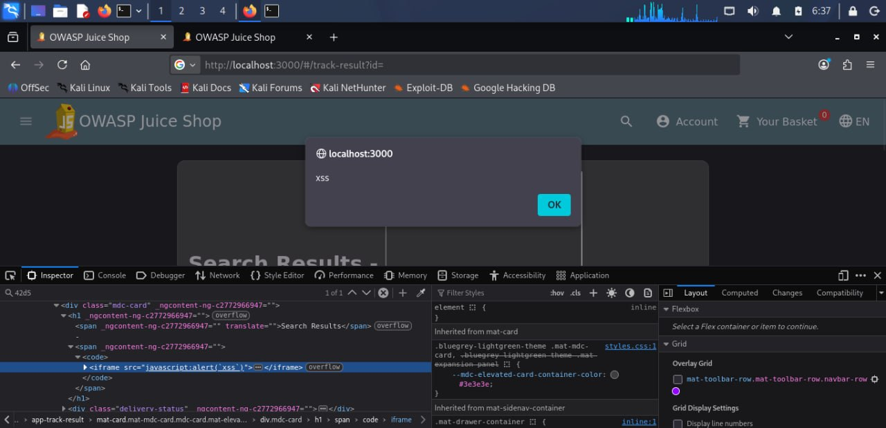

# Cross-Site Scripting (XSS) — Findings

## 1. DOM XSS — Search Functionality

### Summary
Juice Shop's product search feature inserts the user's search term directly into the page without sanitizing it, allowing arbitrary JavaScript execution entirely within the browser (no server round-trip).

### Severity
Medium — requires a victim to visit a crafted URL/search, but enables arbitrary code execution in their browser session.

### Steps to Reproduce
1. Navigate to the Juice Shop search bar
2. Enter a random alphanumeric string, confirm via dev tools (Elements panel) that it's reflected as plain text inside a `<span id="searchValue">` element
3. Replace the search term with the payload below
4. Observe the alert firing immediately upon search

### Proof of Concept

 ``` ```


### Root Cause
User input from the search field is inserted into the DOM without encoding, allowing injected HTML/event-handler attributes to execute as real code.

### Remediation
Encode user input before inserting it into the DOM (e.g., using `textContent` instead of `innerHTML`, or a sanitization library like DOMPurify).

---

## 2. Reflected XSS — Order Tracking

### Summary
Juice Shop's order tracking page reflects the order ID from the URL directly into the page heading ("Search Results - [id]") without sanitization, allowing a reflected XSS attack via a crafted tracking link.

### Severity
Medium — requires a victim to click a malicious tracking link, but enables arbitrary code execution.

### Steps to Reproduce
1. Complete a checkout to obtain a valid order ID and reach the tracking feature
2. Note the URL pattern: `/#/track-result?id=[orderId]`
3. Replace the `id` parameter with the payload below
4. Observe the alert firing on page load

### Proof of Concept

*(Tested on a local Juice Shop instance — URL shown is for demonstration)*

http://localhost:3000/#/track-result?id=<iframe src="javascript:alert(`xss`)">



### Root Cause
The order ID from the URL is echoed directly into the page's heading without input validation or output encoding.

### Remediation
Validate that the `id` parameter matches an expected order ID format (whitelist approach) before use, and encode it on output regardless.
